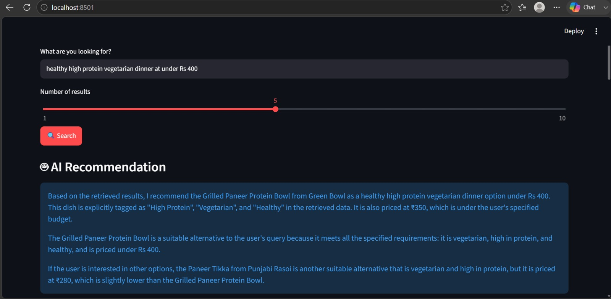
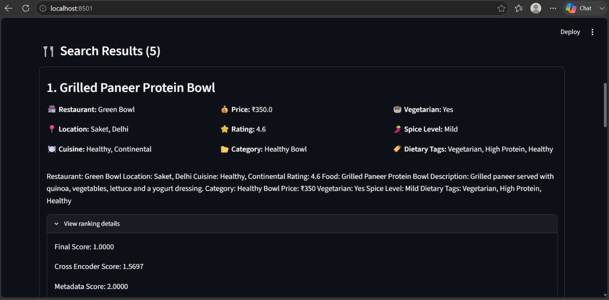

# 🍽️ FoodFlow AI
 
**FoodFlow AI** is an intelligent food search and recommendation system that understands natural-language food queries and retrieves the most relevant dishes using a hybrid AI-powered search pipeline.
 
Instead of relying only on keyword matching, FoodFlow AI combines:
 
- 🧠 Natural Language Query Understanding
- 🔎 Semantic Vector Search
- 🔤 BM25 Keyword Search
- 🔀 Reciprocal Rank Fusion (RRF)
- 🎯 Cross-Encoder Reranking
- 🏷️ Metadata-Based Filtering and Ranking
- 🤖 LLM-Based Food Recommendation
The goal is to understand what the user actually wants and return food items that best match their preferences, dietary requirements, budget, cuisine, spice level, and other constraints.
 
---
 
## 📸 Screenshots
 
<table>
  <tr>
    <td align="center" width="50%">
      
      <br/>
      <sub><b>Search Results</b> — ranked dishes with restaurant, price, rating, and dietary tags</sub>
    </td>
    <td align="center" width="50%">
      
      <br/>
      <sub><b>AI Recommendation</b> — grounded natural-language pick from the retrieved results</sub>
    </td>
  </tr>
</table>
---
 
## 📋 Table of Contents
 
- [Features](#-features)
- [How It Works](#-how-it-works)
- [Example Queries](#-example-queries)
- [Project Architecture](#-project-architecture)
- [API Reference](#-api-reference)
- [Tech Stack](#-tech-stack)
- [Installation](#-installation)
- [Environment Variables](#-environment-variables)
- [Running the Project](#-running-the-project)
- [Design Goals](#-design-goals)
- [Project Status](#-project-status)
- [Future Improvements](#-future-improvements)
- [License](#-license)
---
 
## ✨ Features
 
### 🧠 Natural Language Query Understanding
 
Users can search using natural language instead of structured filters.
 
**Example query:**
```
healthy high protein vegetarian dinner under ₹400
```
 
**Parsed into a structured query:**
```json
{
  "semantic_query": "vegetarian high protein dinner",
  "is_veg": true,
  "max_price": 400,
  "min_rating": null,
  "cuisine": null,
  "spice_level": null,
  "dietary_tags": ["Healthy", "High Protein"]
}
```
 
The query understanding component extracts:
 
| Attribute | Description |
|---|---|
| Veg / Non-Veg | Dietary preference |
| Max price | Budget constraint |
| Min rating | Quality threshold |
| Cuisine | e.g. North Indian, Italian |
| Spice level | Mild, Medium, Hot |
| Dietary tags | Vegan, High Protein, Healthy, etc. |
| Semantic intent | The underlying "meaning" of the request |
 
### 🔎 Hybrid Food Search
 
FoodFlow AI doesn't rely on a single retrieval technique — it fuses multiple approaches for stronger, more relevant results.
 
```
                     User Query
                         │
                         ▼
               Query Understanding
                         │
                         ▼
                  Structured Query
                         │
              ┌──────────┴──────────┐
              │                     │
              ▼                     ▼
        Vector Search           BM25 Search
              │                     │
              └──────────┬──────────┘
                         ▼
                  RRF Rank Fusion
                         │
                         ▼
                 Candidate Results
                         │
                         ▼
                  Cross-Encoder
                    Reranking
                         │
                         ▼
                 Metadata Ranking
                         │
                         ▼
                  Final Results
                         │
                         ▼
               AI Recommendation
```
 
---
 
## 🧩 How It Works
 
### 1. Query Understanding
The user's natural-language query is converted by an LLM into a structured `FoodQuery` object. Extracted values are validated to prevent the LLM from inventing unsupported dietary preferences.
 
### 2. Metadata Filtering
Hard constraints are applied before ranking begins — e.g. `is_veg = true`, `price <= 400`, `rating >= 4.5` — using food metadata stored in ChromaDB. This removes obviously unsuitable items early.
 
### 3. Semantic Vector Search
The semantic query is embedded using **all-MiniLM-L6-v2** and matched against ChromaDB using vector similarity. This lets the system understand *concepts*, not just exact words — e.g. `"high protein dinner"` can surface paneer, chicken, protein bowls, and quinoa dishes even without an exact phrase match.
 
### 4. BM25 Keyword Search
A traditional keyword-based BM25 search runs in parallel, which is especially strong for specific, exact-name queries like `"paneer tikka"`.
 
### 5. Reciprocal Rank Fusion (RRF)
Vector search and BM25 results are merged using RRF, which favors documents ranked highly across *multiple* methods — producing a more robust candidate set than either method alone.
 
```
Vector Rank        BM25 Rank
     │                  │
     └────────┬─────────┘
              ▼
             RRF
              │
              ▼
      Hybrid Ranking
```
 
### 6. Cross-Encoder Reranking
Each candidate is passed through a Cross-Encoder alongside the original query to produce a fine-grained relevance score — more accurate than the initial vector similarity alone.
 
### 7. Metadata-Based Ranking
Cross-Encoder scores are then blended with metadata signals — veg status, dietary tags, price, rating, cuisine, spice level — to produce the final ranked order.
 
### 8. AI Recommendation
An LLM generates a concise, natural-language recommendation grounded strictly in the retrieved data (no invented facts).
 
**Example output:**
> Based on your query for a healthy high protein vegetarian dinner under ₹400, I recommend the **Grilled Paneer Protein Bowl** from **Green Bowl** in Saket, Delhi. This dish is tagged as *High Protein*, *Vegetarian*, and *Healthy*, and is priced at ₹350 — within your budget.
 
---
 
## 🖥️ Streamlit Interface
 
FoodFlow AI ships with a Streamlit UI where users can:
 
- Enter natural-language food queries
- Select the number of results to return
- View ranked food recommendations
- See restaurant name, location, price, and rating
- Check vegetarian status, spice level, and dietary tags
- Read the AI-generated recommendation
- Inspect ranking scores when needed
---
 
## 🧪 Example Queries
 
<details>
<summary><strong>Healthy vegetarian dinner</strong></summary>
**Query:** `healthy high protein vegetarian dinner under ₹400`
 
**Result:**
- Grilled Paneer Protein Bowl — Green Bowl — ₹350 — Vegetarian, High Protein, Healthy
</details>
<details>
<summary><strong>Cuisine-based search</strong></summary>
**Query:** `spicy North Indian food under ₹400`
 
**Extracted:**
```json
{
  "cuisine": "North Indian",
  "spice_level": "Hot",
  "max_price": 400
}
```
 
</details>
<details>
<summary><strong>Specific food search</strong></summary>
**Query:** `paneer tikka`
 
Hybrid retrieval prioritizes exact matches like **Paneer Tikka** using both semantic and keyword signals.
 
</details>
<details>
<summary><strong>Dietary search</strong></summary>
**Query:** `vegan food under ₹300`
 
**Extracted:**
```json
{
  "dietary_tags": ["Vegan"],
  "max_price": 300
}
```
 
</details>
---
 
## 🏗️ Project Architecture
 
```
foodflow-ai/
│
├── app/
│   ├── api/               # FastAPI routes
│   ├── config/             # App settings
│   ├── data/                # Data loading utilities
│   ├── embeddings/       # Embedding service
│   ├── ingestion/          # Data ingestion pipeline
│   ├── llm/                    # LLM service
│   ├── logger/               # Logging utilities
│   ├── models/              # Pydantic models (e.g. query.py)
│   ├── query/                # Query understanding
│   ├── ranking/             # Metadata ranking
│   ├── recommendation/  # AI recommendation service
│   ├── reranking/          # Cross-encoder reranking
│   ├── retrieval/            # BM25 + hybrid retrieval
│   ├── search/               # Semantic search
│   └── vector_store/     # ChromaDB service
│
├── data/
│   └── restaurants.json
│
├── docs/
│   ├── foodflow-search.png
│   └── foodflow-recommendation.png
│
├── chroma_db/
│
├── streamlit_app.py
├── requirements.txt
├── README.md
└── .gitignore
```
 
---
 
## 🔌 API Reference
 
FoodFlow AI exposes a FastAPI endpoint for food search.
 
### `POST /api/search`
 
**Request**
```json
{
  "query": "healthy high protein vegetarian dinner under ₹400",
  "top_k": 5
}
```
 
**Response**
```json
{
  "results": [
    {
      "text": "...",
      "metadata": {
        "item_name": "Grilled Paneer Protein Bowl",
        "restaurant_name": "Green Bowl",
        "location": "Saket, Delhi",
        "price": 350,
        "rating": 4.6,
        "is_veg": true,
        "spice_level": "Mild",
        "dietary_tags": "Vegetarian, High Protein, Healthy"
      },
      "cross_encoder_score": 3.56,
      "metadata_score": 2.0,
      "final_score": 1.0
    }
  ],
  "recommendation": "..."
}
```
 
You can also test the API interactively via Swagger UI at `/docs`.
 
---
 
## 🛠️ Tech Stack
 
| Technology | Purpose |
|---|---|
| Python | Core AI application |
| FastAPI | REST API |
| Streamlit | User interface |
| Hugging Face API | LLM inference |
| Sentence Transformers | Text embeddings |
| all-MiniLM-L6-v2 | Embedding model |
| ChromaDB | Vector database |
| BM25 | Keyword retrieval |
| RRF | Hybrid retrieval fusion |
| Cross-Encoder | Result reranking |
| Pydantic | Data validation |
| Uvicorn | ASGI server |
 
---
 
## 📦 Installation
 
**1. Clone the repository**
```bash
git clone https://github.com/nidhi2356/foodflow-ai.git
```
 
**2. Move into the project**
```bash
cd foodflow-ai
```
 
**3. Create a virtual environment**
```bash
python -m venv venv
```
 
**4. Activate it**
 
Windows:
```bash
venv\Scripts\activate
```
 
macOS / Linux:
```bash
source venv/bin/activate
```
 
**5. Install dependencies**
```bash
pip install -r requirements.txt
```
 
---
 
## 🔐 Environment Variables
 
Create a `.env` file in the project root:
 
```env
HF_API_TOKEN=your_hugging_face_token
```
 
> ⚠️ **Do not commit your `.env` file.**
 
Make sure `.gitignore` includes:
 
```
.env
venv/
__pycache__/
*.pyc
chroma_db/
```
 
---
 
## ▶️ Running the Project
 
### Start the FastAPI server
```bash
uvicorn app.main:app --reload
```
 
- API: [http://127.0.0.1:8000](http://127.0.0.1:8000)
- Swagger docs: [http://127.0.0.1:8000/docs](http://127.0.0.1:8000/docs)
### Start the Streamlit app
 
In a separate terminal:
```bash
streamlit run streamlit_app.py
```
 
- App: [http://localhost:8501](http://localhost:8501)
---
 
## 🎯 Design Goals
 
FoodFlow AI is built around four core principles:
 
**1. Understand the user**
Instead of manually selecting filters like *Cuisine: North Indian, Veg: Yes, Price: <₹400, Spice: Hot*, users simply write:
> `spicy North Indian vegetarian food under ₹400`
 
**2. Combine multiple retrieval methods**
Semantic search understands meaning, BM25 understands exact keywords, RRF fuses both, and Cross-Encoder + metadata ranking refine relevance further.
 
**3. Ground AI recommendations**
The recommendation model only describes what's actually in the data. If a dish is tagged *High Protein*, the system will say that — but won't invent details like *"contains 20g of protein"* unless that's genuinely in the dataset.
 
**4. Separate AI responsibilities**
 
| Component | Responsibility |
|---|---|
| Query Understanding | Understand the request |
| Retrieval | Find candidates |
| Reranking | Improve relevance |
| Metadata Ranking | Apply preferences |
| Recommendation | Explain the best result |
 
---
 
## 🚀 Project Status
 
### AI System
- [x] Restaurant data loading
- [x] Document generation
- [x] Embedding generation
- [x] ChromaDB integration
- [x] Semantic search
- [x] Query understanding
- [x] Metadata filtering
- [x] Metadata scoring
- [x] Cross-Encoder reranking
- [x] BM25 retrieval
- [x] Reciprocal Rank Fusion
- [x] Hybrid retrieval
- [x] Final ranking
- [x] AI recommendation
- [x] FastAPI search endpoint
- [x] API validation
- [x] Streamlit interface
### Backend
- [ ] 🚧 Spring Boot backend
- [ ] 🚧 PostgreSQL integration
- [ ] 🚧 Authentication and authorization
- [ ] 🚧 Restaurant/menu CRUD
- [ ] 🚧 Order management
- [ ] 🚧 AI integration
---
 
## 🔮 Future Improvements
 
- User authentication
- Personalized recommendations
- Restaurant management
- Menu management
- Order management
- Search history
- User preference history
- Personalized ranking
- Restaurant availability
- Better recommendation explanations
- Larger food datasets
- Production-grade vector database
- Scalable model inference
- Frontend integration
---
 
## 👨‍💻 About the Project
 
FoodFlow AI is the AI/search component of the larger **FoodFlow** food ordering and recommendation platform. The AI service is designed to work independently and expose search functionality through a REST API, making it easy to integrate with a separate backend and frontend.
 
---
 
## ⭐ Example Walkthrough
 
**User query:**
```
healthy high protein vegetarian dinner under ₹400
```
 
**FoodFlow AI results:**
 
1. **Grilled Paneer Protein Bowl** — Green Bowl — ₹350
   `Vegetarian` `High Protein` `Healthy`
2. **Paneer Tikka** — Punjabi Rasoi — ₹280
   `Vegetarian` `High Protein`
**AI Recommendation:**
> Grilled Paneer Protein Bowl from Green Bowl — because it satisfies the key requirements extracted from the user's query.
 
---
 
## 📌 License
 
This project is developed for educational and portfolio purposes.
 